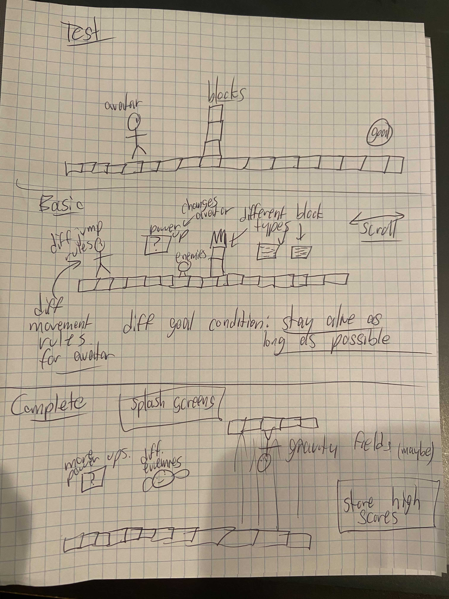

# OOGA Design Plan

Introduction
This section describes the game genre your team is trying to represent by writing this program, the primary design goals of the project (i.e., where is it most flexible), and the primary architecture of the design (i.e., what is closed and what is open). Discuss the design at a high-level (i.e., without referencing specific classes, data structures, or code).
Overview
This section serves as a map of your design for other programmers to gain a general understanding of how and why the program was divided up, and how the individual parts work together to provide the desired functionality. Describe specific modules you intend to create, their purpose with regards to the program's functionality, and how they collaborate with each other, focusing specifically on each one's API. Include a picture of how the modules are related (these pictures can be hand drawn and scanned in, created with a standard drawing program, or screen shots from a UML design program). Discuss specific classes, methods, and data structures, but not individual lines of code.
Design Details 
This section describes each module introduced in the Overview in detail (as well as any other sub-modules that may be needed but are not significant to include in a high-level description of the program). Describe how each module's API handles specific features given in the assignment specification, what resources it might use, how it collaborates with other modules, and how each could be extended to include additional requirements (from the assignment specification or discussed by your team). Finally, justify the decision to create each module with respect to the design's key goals, principles, and abstractions.
Example games
Describe three example games that differ significantly in detail. Clearly identify how the functional differences in these games is supported by your design. Use these examples to help clarify the abstractions in your design. These do not need to be the same as the final ones you implement but could be.
Design Considerations 
This section describes any issues which need to be addressed or resolved before attempting to devise a complete design solution. Include any design decisions discussed at length (include pros and cons from all sides of the discussion) as well as any ambiguities, assumptions, or dependencies regarding the program that impact the overall design.

##Introduction

We are making the OOGA project with the platformer genre. Platformer 

### Overall Design Goal
Make a program capable of loading platformer games from data files. We want it to be able to load 
at least three types of games with meaningfully different rule sets, such as Mario, Flappy Bird,
and Doodle Jump. This will be accomplished by having the data files change basic behaviors of the
game engine, such as avatar type, scrolling behavior, and goal state.

In addition to functionality, we will make sure that this program follows all 
design principles that we learned in class.

### Project Emphasis
* Better design
* Flexibility
* Allow users to select/make different configurations

### Project Progress

#### Sprint 1 (Test)
- Be able to load a level of a platform game.
- Move player around using arrow keys and jump with spacebar
- Have obstacles
- Developing a win/lose condition reaching a point in the level
- Use clear model, view, controller

#### Sprint 2 (Basic)
- Add additional levels
- Apply different textures to features of the game
- Add functional Power ups.
- Make different types of Blocks: Breakable, Unbreakable, Powerup, Damage
- Make the game scrollable: autoscroll, follow the player scroll type
- Make enemies/oppositions

#### Sprint 3 (Complete)
- Make a functional platform game: Mario, Flappy Birds, Mario Galaxy
- Switch between different versions of the game
- Display caught exceptions
- Making better Power ups
- Keep track of scores and high scores

optional:
- Change speed as game proceeds
- Gravity fields

Below is a drawing of the types of levels that we aim to implement after Test, Basic and Complete
respectively.
