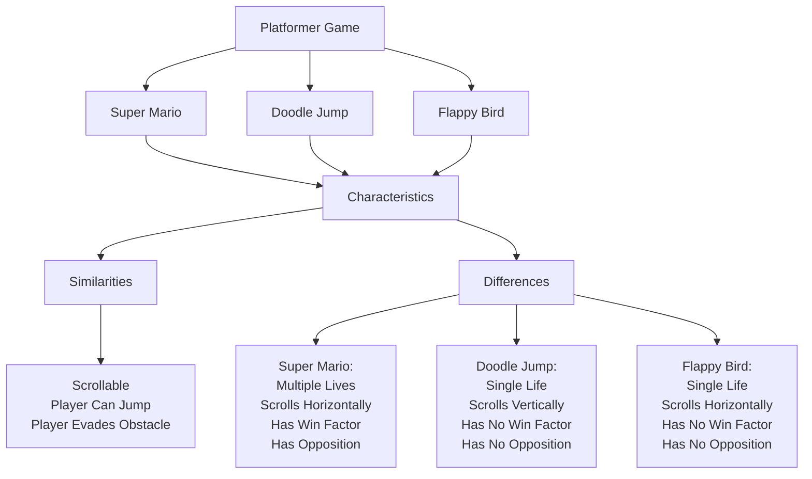
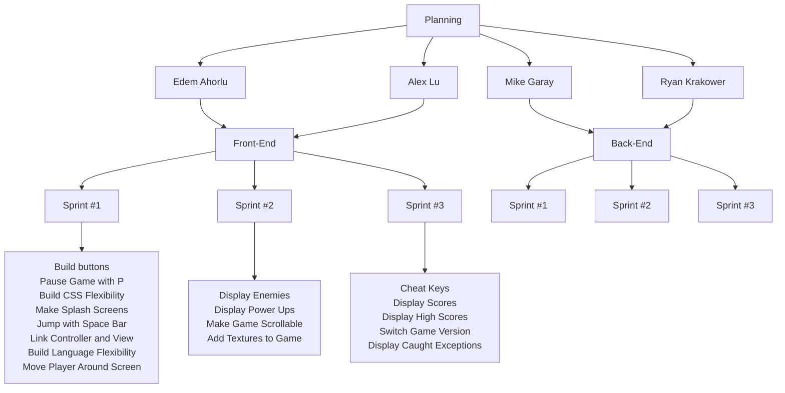

# Team 02 (BORAT)

#### Edem Ahorlu
#### Alex Lu
#### Mike Garay
#### Ryan Krakower

## Scrolling Platformer Game

```mermaid
graph TD;
Platformer[Platformer Game]-->SuperMario[Super Mario]
Platformer[Platformer Game]-->DoodleJump[Doodle Jump]
Platformer[Platformer Game]-->FlappyBirds[Flappy Bird]
SuperMario[Super Mario]-->Characteristics
DoodleJump[Doodle Jump]-->Characteristics
FlappyBirds[Flappy Bird]-->Characteristics
Characteristics-->Similarities
Characteristics-->Differences
Similarities-->List[Scrollable<br/>Player Can Jump<br/>Player Evades Obstacle]
Differences-->Mario[Super Mario:<br/>Multiple Lives<br/>Scrolls Horizontally<br/>Has Win Factor<br/>Has Opposition]
Differences-->Doodle[Doodle Jump:<br/>Single Life<br/>Scrolls Vertically<br/>Has No Win Factor<br/>Has No Opposition]
Differences-->Flappy[Flappy Bird:<br/>Single Life<br/>Scrolls Horizontally<br/>Has No Win Factor<br/>Has No Opposition]
```

## Features

```mermaid
graph TD;
  Planning-->Edem[Edem Ahorlu]
  Planning-->Alex[Alex Lu]
  Planning-->Mike[Mike Garay]
  Planning-->Ryan[Ryan Krakower]
  Edem[Edem Ahorlu]-->FrontEnd[Front-End]
  Alex[Alex Lu]-->FrontEnd[Front-End]
  Mike[Mike Garay]-->BackEnd[Back-End]
  Ryan[Ryan Krakower]-->BackEnd[Back-End]
  FrontEnd[Front-End]-->1[Sprint #1]
  FrontEnd[Front-End]-->2[Sprint #2]
  FrontEnd[Front-End]-->3[Sprint #3]
  BackEnd[Back-End]-->S1[Sprint #1]
  BackEnd[Back-End]-->S2[Sprint #2]
  BackEnd[Back-End]-->S3[Sprint #3]
  1[Sprint #1]-->F1[Build buttons<br/>Pause Game with P<br/>Build CSS Flexibility<br/>Make Splash Screens<br/>Jump with Space Bar<br/>Link Controller and View<br/>Build Language Flexibility<br/>Move Player Around Screen]
  2[Sprint #2]-->F2[Display Enemies<br/>Display Power Ups<br/>Make Game Scrollable<br/>Add Textures to Game]
  3[Sprint #3]-->F3[Cheat Keys<br/>Display Scores<br/>Display High Scores<br/>Switch Game Version<br/>Display Caught Exceptions]

```