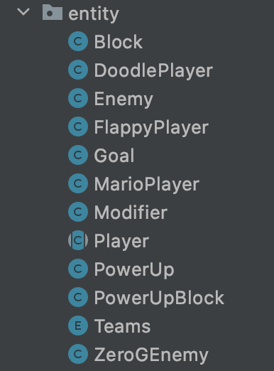

# Team 02 (BORAT)

#### Alex Lu
#### Mike Garay
### Edem Ahorlu
#### Ryan Krakower


##DEMO

##DISCUSSION

####Design goals / Open/closed / data driven: 5 min - Ryan and Mike
* Level’s use of instanceof vs polymorphism 
    * An alternative would have been to have most methods present in the main IEntity interface, but then that would lead to a lot of unnecessary methods present in classes that don’t need them, which left our hands tied. We decided the best course of action was using instanceof and referring to the interfaces, which would easily support extension.

```java
public class Level {
/* constructor and other methods */
 /**
   * Removes an entity from the level by removing it from all lists of entities.
   * @param entity to be removed.
   */
  @Override
  public void removeEntity(IEntity entity) {
    if(entity != null){
      this.entityList.remove(entity);
    }
    if (entity instanceof Block) {
      this.blockList.remove(entity);
    }
    if (entity instanceof Enemy) {
      this.enemyList.remove(entity);
      score+=ENEMY_SCORE;
    }
    if (entity instanceof Player) {
      this.playerList.remove(entity);
    }
    /* more cases */
  }
}
```

* Open/closed
    * Level and LevelLoader could be more closed - there are a lot of getter methods to access copies of lists
    * Entities could be a bit more closed - instead of accessing the hitboxes directly using a public method (getHitbox), we should have only referred directly to the positional and dimensional values of the hitbox
    * Scroller is open/closed - you just implement Scroller into a new Scroller class, add it to the ScrollerFactory, and then you can use it via the configuration value without having to modify the original Scroller interface at all
    * ITexturer is open/closed - you just implement ITexturer into a new Texturer class and then replace the existing texturer in GameView and you won’t have to modify any of the original functionality of ITexturer
* Data driven
    * Custom level generation, textures, level sequence, player type, scroller type
    * Things that should have been data-driven: health/damage, power-ups, movement speed, jump speed, gravity factor


####APIs and use cases: 5 min - Mike and Alex

**IENTITY**

```java
/**
 * An interface used as the basis for all entities in a level
 * @author Mike Garay and Ryan Krakower
 */
public interface IEntity {

    /**
     * Obtains the stored Hitbox instance of the entity
     * @apiNote : This should be amended to return an IHitbox instance, not a Hitbox instance
     * @return The Hitbox instance stored in the entity instance
     */
    HitBox getHitBox();

    /**
     * A generic handler for checking any collisions between this entity and another entity
     * Being a handler, it should contain any logic for when there are collisions present
     * @param entity The other entity to check for any possible collisions with
     */
    void checkCollision(IEntity entity);

   /* other methods */

    /**
     * Obtains a String representing the stored type of this entity
     * This should usually obtain the name of the implementing class
     * and can be used to avoid instanceof/downcasting if not absolutely required
     * @return A String representing the type of this entity
     */
    String getType();
}
```
**Implemented by Player**

```java
/**
 * A class for entities that are players
 * @author Mike Garay and Ryan Krakower
 */
public abstract class Player implements IEntity, IMovable, IDamageable, IPlayer {

  //private final String type = this.getClass().getSimpleName();
  private final String type = "Player";
  public static final int GRACE_PERIOD = 1;
  public static final double GRAVITY_FACTOR = 0.015f;
  private double xVel = 0;
  private double yVel = 0;
  protected HitBox hitBox;
  private boolean grounded = true;
  private double health = 0;
  private double damage = 0;
  private final Map<Modifier.ModifierType, Modifier> modifiers = new HashMap<>();
  private ICollisionHandler currentCollision = new CollisionDirections();

  /**
   * Constructs a Player given an x-coordinate and a y-coordinate
   * @param x The x-coordinate to construct this Player's Hitbox with
   * @param y The y-coordinate to construct this Player's Hitbox with
   */
  public Player(double x, double y){
    this.hitBox = new HitBox(x, y);
    this.setHealth(100);
    this.setCollisionDamage(100);
  }

  /**
   * Updates the velocity of the player given key inputs
   * @param leftKey A boolean reprsenting whether or not the "move left" key was pressed
   * @param rightKey A boolean representing whether or not the "move right" key was pressed
   * @param jumpKey A boolean representing whether or not the "jump" key was pressed
   */
  public abstract void updateVelocity(boolean leftKey, boolean rightKey, boolean jumpKey);

  /**
   * An accessor for the movement speed modifier value of an IPlayer
   * @implNote : It should return a default value if the modifier is not present
   * @return The movement speed modifier value of an IPlayer
   */
  @Override
  public double getMovementSpeedModifierValue(){
    Modifier movementSpeedModifier = this.getModifiers().get(Modifier.ModifierType.MOVEMENT_SPEED);
    return movementSpeedModifier != null ? movementSpeedModifier.getValue() : 1;
  }

  /**
   * An accessor for the movement speed modifier value of an IPlayer
   * @implNote : It should return a default value if the modifier is not present
   * @return The jump speed modifier value of an IPlayer
   */
  @Override
  public double getJumpSpeedModifierValue(){
    Modifier jumpSpeedModifier = this.getModifiers().get(Modifier.ModifierType.JUMP_SPEED);
    return jumpSpeedModifier != null ? jumpSpeedModifier.getValue() : 1;
  }

  /**
   * An accessor for the anti-gravity modifier value of an IPlayer
   * @implNote : It should return a default value if the modifier is not present
   * @return The anti-gravity modifier value of an IPlayer
   */
  @Override
  public double getAntiGravityModifierValue(){
    Modifier gravityModifier = this.getModifiers().get(Modifier.ModifierType.ANTI_GRAVITY);
    return gravityModifier != null ? gravityModifier.getValue() : 1;
  }

  /**
   * Updates the position of this player - Should be used for game type specific
   * position updates determines by the extending class
   */
  public abstract void updatePosition();

  /**
   * A  handler for checking any collisions between this entity and another entity
   *
   * If the other entity is an instance of IDamageable, this player attempts to apply damage to it
   *
   * If the other entity is an instance of IEmpowering and the collision directions are not empty,
   * this player attempts to retrieve a modifier from it and then has it call
   * IEmpowering#sethasAppliedModifier to true if the player successfully obtains the modifier
   *
   * If the other entity is an instance of ISpawner and the collision directions are not empty,
   *
   * ISpawner#attemptCreateAndAddSpawn is called to attempt to make it spawn an entity
   * If the entity is an instance of IWinnable and the collision directions are not empty,
   * IWinnable#setHasWon is called to set it to true that the player has "won" it
   *
   * @param entity The other entity to check for any possible collisions with
   */
  public void checkCollision(IEntity entity) {
    CollisionDirections collision = hitBox.getCollisionDirections(entity.getHitBox());
    currentCollision.add(collision);
    this.processCurrentCollision(entity, collision);
    if (entity instanceof IDamageable) {
      this.attemptApplyDamage((IDamageable) entity, collision);
    }
    if (entity instanceof IEmpowering && !collision.isEmpty()) {
      IEmpowering empowering = (IEmpowering) entity;
      if (!empowering.hasAppliedModifier()) {
        if(empowering.getModifier() != null){
          this.applyModifier(empowering.getModifier());
        }
        empowering.setHasAppliedModifier(true);
      }
    }
    if (entity instanceof ISpawner && !collision.isEmpty()) {
      ISpawner spawner = (ISpawner) entity;
      spawner.attemptCreateAndAddSpawn(collision);
    }
    if (entity instanceof IWinnable && !collision.isEmpty()) {
      IWinnable goal = (IWinnable) entity;
      goal.setHasWon(true);
    }
  }

  /**
   * Obtains the stored Hitbox instance of the entity
   * @apiNote : This should be amended to return an IHitbox instance, not a Hitbox instance
   * @return The Hitbox instance stored in the entity instance
   */
  @Override
  public HitBox getHitBox() {
    return hitBox;
  }

  /**
   * Sets the x velocity for this entity
   * @param xVel The x velocity to set for this entity
   */
  @Override
  public void setXVel(double xVel) {
    this.xVel = xVel;
  }

  /**
   * Sets the y velocity for this entity
   * @param yVel The y velocity to set for this entity
   */
  @Override
  public void setYVel(double yVel) {
    this.yVel = yVel;
  }

  /**
   * Obtains the x velocity for this entity
   * @return The current x velocity of this entity
   */
  @Override
  public double getXVel() {
    return xVel;
  }

  /**
   * Obtains the y velocity for this entity
   * @return The current y velocity of this entity
   */
  @Override
  public double getYVel() {
    return yVel;
  }

  /**
   * Obtains a String representing the stored type of this entity
   * This should usually obtain the name of the implementing class
   * and can be used to avoid instanceof/downcasting if not absolutely required
   * @return A String representing the type of this entity
   */
  @Override
  public String getType() {
    return type;
  }

  /**
   * Obtains whether or not this entity is "grounded", aka
   * it should not be considered airborne
   * @return Whether or not this entity is grounded
   */
  @Override
  public boolean getGrounded() {
    return grounded;
  }

  /**
   * Sets whether or not this entity is "grounded", aka
   * whether or not is should be considered airborne
   * @param grounded The boolean to set the grounded value to
   */
  @Override
  public void setGrounded(boolean grounded) {
    this.grounded = grounded;
  }

  /**
   * Translates the hitbox of this player using its current velocity
   * then clears its current collision handler
   */
  public void translateHitBox() {
    this.getHitBox().translateX(this.getXVel());
    this.getHitBox().translateY(this.getYVel());
    this.currentCollision.clear();
  }

  // applies gravity to the player, taking into account the anti-gravity modifier it may have
  protected void applyGravity() {
    double antiGravityValue = this.getAntiGravityModifierValue();
    double adjustedAntiGravityValue = 1 - ((antiGravityValue - 1));
    double yVelWithGravity = this.getYVel() + (GRAVITY_FACTOR * adjustedAntiGravityValue);
    this.setYVel(yVelWithGravity);
  }

  /**
   * Accesses the current health of this damageable
   * @return the current health of this damageable
   */
  @Override
  public double getHealth() {
    return this.health;
  }

  /**
   * Sets the current health of this damageable
   * @param health The health to set the health of this damageable to
   */
  @Override
  public void setHealth(double health) {
    this.health = health;
  }

  /**
   * Accesses the current collision damage of this damageable
   * @return The current collision damage of this damageable
   */
  @Override
  public double getCollisionDamage() {
    return this.damage;
  }

  /**
   * Sets the current collision damage of this damageable
   * @param collisionDamage The collision damage to set the collision damage of this damageable to
   */
  @Override
  public void setCollisionDamage(double collisionDamage) {
    this.damage = collisionDamage;
  }

  /**
   * Returns a list of CollisionDirections that this damageable can apply damage from
   * @return The list of CollisionDirections that this damageable can apply damage from
   */
  @Override
  public ICollisionHandler getAppliesDamageDirections() {
    return new CollisionDirections(Collections.singletonList(Direction.BOTTOM));
  }

  /**
   * Returns a list of CollisionDirections that this damageable can receive damage from
   * @return The list of CollisionDirections that this damageable can receive damage from
   */
  @Override
  public ICollisionHandler getReceivesDamageDirections() {
    return new CollisionDirections(Arrays.asList(Direction.TOP, Direction.BOTTOM, Direction.LEFT, Direction.RIGHT));
  }

  // obtains the current collision handler instance of this player
  protected ICollisionHandler getCurrentCollision() {
    return this.currentCollision;
  }

  /**
   * An accessor for the ModifierType to Modifier map of an IPlayer
   * @return The ModifierType to Modifier map of an IPlayer
   */
  @Override
  public Map<Modifier.ModifierType, Modifier> getModifiers() {
    return this.modifiers;
  }

  /**
   * Obtains the Team this entity belongs to
   * @return The Team this entity belongs to
   */
  @Override
  public Teams getTeam() {
    return Teams.PLAYER;
  }

  /**
   * Determines whether or not this entity is dead - by default, it checks if its health is less than or equal to 0
   * @return Whether or not this entity is dead
   */
  @Override
  public boolean isDead() {
    return this.health <= 0;
  }
}
```

**SCROLLER**

* Scroller - three main methods - getScoreFromScroll(), scroll(level, player), reset()
    * Use case: ManualScroller and AutoScroller
    
```java
/**
 * The Scroller interface
 */
public interface Scroller {
    int NUM_BLOCKS = 15;

    /**
     * Scrolls the level, perhaps based on the actions of player
     * @param level the Level object to be scrolled
     * @param player the Player object whose actions might determine the scrolling of level
     */
    void scroll(Level level, Player player);

    /**
     * Resets the scroller
     */
    void reset();

    /**
     * Returns an integer value which should be added to the user's score due to survival of
     * the last scroll
     * @return an integer value representing the score gained by the user from the last scroll
     */
    int getScoreFromScroll();
}
```

**AUTOSCROLLER**

```java
public class AutoScroller implements Scroller
{
  /* constructor and other methods */

  /**
   * Scrolls the list of Entitiies
   * @param level the level to be scrolled
   * @param player the player of the level
   */
  @Override
  public void scroll(Level level, Player player) {
    level.translateAllEntities(xScroll, yScroll);

    if (playerScrolls) {
      scrollPlayer(player);
    }
  }

  /**
   * Resets the scroller
   */
  @Override
  public void reset() {
    //DO NOTHING
  }


  /**
   * Returns an integer value which should be added to the user's score due to survival of
   * the last scroll
   * @return SCORE_FROM_SCROLL
   */
  @Override
  public int getScoreFromScroll() {
    return SCORE_FROM_SCROLL;
  }
}
```

####Two designs (MVC and entity hierarchy): 5 min - Mike and Edem

* Model-view-controller was something that remained consistent since the beginning of the project - we wanted to make sure the user only had direct access to the controller, which would handle manipulating model, which would handle updating what was seen by the user in view. It also made it simpler to divide up the work for the project, as 2 people would work on view/controller while 2 people worked on model.
* Entity hierarchy - originally it was more abstraction/inheritance based, with a single Entity class being the superclass of all other entity classes on top of a lot of other abstractions. By the end, the Entity superclass turned into the IEntity interface, and there was less of a hierarchy overall and more reliance on interfaces to give each type of entity its necessary properties.



####Teamwork

* Completed vs wireframe
    * Breaking the project into smaller milestones increased productivity since our project was organized to implement the most relevant features in each milestone without having to deal with the pressure of thinking about the complete implementation of the project
    * It allowed for flexibility and adaptability since we were able to take feedback from each milestone and better design  features we implemented that 
    * Helped track progress as we proceeded with the project
    * It made identifying code errors/bugs easier since each milestone had specific features that needed to be implemented
    
* Something each team member learned about managing large project
    * Better grasp of git and gitlab and learnt how to manage merge conflicts better
    * Learn how to respect each other’s opinions and respond to constructive feedback
    * Large projects can be better managed when broken down into smaller chunks
    * Managing large projects requires increased collaboration since different members work individually on different aspects of the project which are supposed to be integrated

* Things we improved, things we can still improve
    * We improved on moving past differences, listening and actually considering each others views about various design decisions
    * We improved on managing our projects better with git. We started off with a lot of merge conflicts and haven’t had that in these past couple of days
    * We can still improve on our punctuality to team meetings
    * We could have improved on having each member talk a little bit about code they implemented to help team member’s have a rough idea about each other’s progress

* One thing we each learned about positive team culture
    * Created an environment where everybody can express their views without fear of any form of judgement
    * Fostered collaboration since team members were ready to help each other
    * Encouraged positivity which helped us accomplish all goals we set at the beginning of the project
    * Fostered a social community where we got to interact and talk about stuff outside the project: including recommendations for movies and tv shows, and helping other team members on programming stuff outside class

* Revisit team contract, one thing we each learned about communicating and solving problems 
    * Problems between team members could be easily resolved by allowing the parties involved voice out their complaints with other team members mediating.
    * Conflicting team decisions were easily resolved by analyzing the pros and cons of each idea and voting the best idea
    * Respecting and listening to each other fostered positive team work
    * Showing gratitude for a favor and giving compliments like nice job, well done, and you’re a genius boosted camaraderie and created a more social environment


